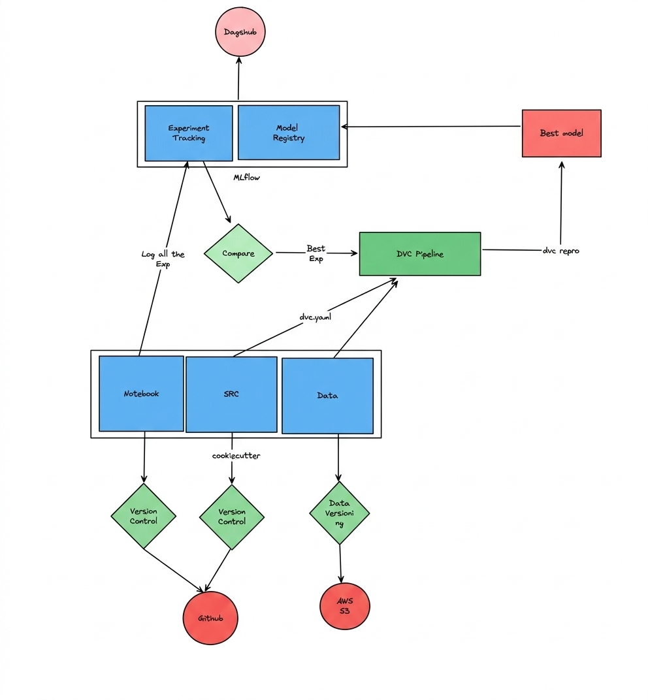

# 🚀 Employee Churn Prediction – End-to-End MLOps Pipeline


An end-to-end **Machine Learning + MLOps production-ready project** that predicts employee churn using modern best practices including:

- ✅ Modular ML Pipeline Architecture  
- ✅ Data Versioning with DVC  
- ✅ Code Versioning with Git  
- ✅ Experiment Tracking with MLflow  
- ✅ Model Registry (MLflow via DagsHub)  
- ✅ Reproducible ML Workflows  
- ✅ Artifact Management  
- ✅ Production-Grade Project Structure  

---

# 📌 Project Overview

Employee churn is a critical business problem that impacts organizational growth and profitability.  
This project builds a **fully reproducible and production-ready ML system** that:

1. Ingests raw data  
2. Handles outliers  
3. Performs feature engineering  
4. Trains and evaluates models  
5. Tracks experiments  
6. Registers the best model  
7. Versions data and pipelines  

This is not just a notebook-based project — it follows **real-world MLOps practices**.

---

# 🏗️ Architecture Flow

## Architecture Image



## 🔷 1️⃣ Code Versioning – Git & GitHub
- All source code is version controlled using Git
- Hosted on GitHub
- `.gitignore` and `.dvcignore` configured properly
- Enables collaboration and rollback capability

---

## 🔷 2️⃣ Data & Pipeline Versioning – DVC

We use **DVC (Data Version Control)** to:

- Version datasets
- Track ML pipeline stages
- Store large artifacts outside Git
- Ensure full reproducibility

### Pipeline Stages (Defined in `dvc.yaml`)

- Data Ingestion
- Outlier Handling
- Feature Transformation
- Model Training
- Model Evaluation

Run the complete pipeline:

```bash
dvc repro
```
Pull data artifacts:
```bash
dvc pull
```
## 🔷 3️⃣ Experiment Tracking – MLflow (via DagsHub)

MLflow is integrated to manage and monitor the complete experimentation lifecycle.

### 📌 What is Logged?

- Hyperparameters  
- Evaluation metrics (Accuracy, Precision, Recall, F1-Score)  
- Model artifacts (trained model)  
- Preprocessing artifacts (Column Transformer)  
- Nested runs for hyperparameter tuning  

### 📊 Each Training Run Records:

- Parameters  
- Metrics  
- Artifacts  
- Best estimator  

This enables:

- Comparison of multiple model runs  
- Performance tracking across experiments  
- Centralized artifact storage  
- Transparent experiment history  

The tracking server is hosted on **DagsHub MLflow**, ensuring cloud-based experiment management and accessibility.

---

## 🔷 4️⃣ Model Registry

After identifying the best-performing model:

- The model is registered in the **MLflow Model Registry**  
- Automatically version controlled  
- Prepared for staging or production transition  

### 🎯 Why Model Registry?

- Enables proper model lifecycle management  
- Maintains traceability of model versions  
- Supports controlled promotion from staging to production  
- Ensures reliable deployment workflows  

This completes the end-to-end MLOps cycle from experimentation to production readiness.

## 📂 Project Structure
```
EMPLOYEE_CHURN_PREDICTION/
│
├── .dvc/
├── data/
├── models/
│   ├── column_transformer.pkl
│   ├── rf_model.pkl
│
├── notebooks/
│   ├── employee-churn-prediction.ipynb
│
├── reports/
│
├── src/
│   ├── data/
│   │   ├── data_ingestion.py
│   │   ├── handle_outlier.py
│   │
│   ├── features/
│   │   ├── feature_transform.py
│   │
│   ├── model/
│   │   ├── train_model.py
│   │   ├── test_model.py
│   │   ├── register_model.py
│   │
│   ├── logging_config.py
│
├── dvc.yaml
├── dvc.lock
├── .gitignore
├── .dvcignore
└── README.md
```

# ⚙️ Pipeline Workflow (Step-by-Step)

### 🟢 Step 1: Data Ingestion
- Load raw dataset  
- Save cleaned intermediate dataset  

### 🟢 Step 2: Outlier Handling
- Detect and remove outliers  
- Improve data quality  

### 🟢 Step 3: Feature Engineering
- Apply `ColumnTransformer`  
- Encode categorical variables  
- Scale numerical variables  
- Save preprocessing artifact  

### 🟢 Step 4: Model Training
- Train Random Forest Classifier  
- Perform hyperparameter tuning (GridSearchCV)  
- Log nested MLflow runs  
- Select best-performing model  

### 🟢 Step 5: Model Evaluation
- Accuracy  
- Precision  
- Recall  
- F1-Score  

### 🟢 Step 6: Model Registration
- Register best model in MLflow Model Registry  
- Store model artifacts  

---

# 🔁 Reproducibility

This project ensures complete reproducibility through:

- **Git** → Code versioning  
- **DVC** → Data & pipeline versioning  
- **MLflow** → Experiment & model tracking  
- **Virtual Environment** → Dependency isolation  

### Reproduce the Project

```bash
git clone https://github.com/umiii-786/employee-churn-prediction.git
cd employee-churn-prediction

pip install -r requirements.txt
dvc pull
dvc repro
```

#  🤖 FAST-API WEB App:
Clone this Repo For interacting with Model:

```bash  
git clone https://github.com/umiii-786/employee-churn-fastApi-app
```

# 🛠️ Tech Stack

- Python  
- Pandas  
- NumPy  
- Scikit-Learn  
- MLflow  
- DVC  
- Git & GitHub  
- DagsHub  
- YAML  

---

# 🌟 Production Features

- ✔ Modular architecture  
- ✔ Logging configuration  
- ✔ Exception handling  
- ✔ Reproducible pipelines  
- ✔ Data versioning  
- ✔ Experiment tracking  
- ✔ Model registry  

# 🚀 Future Improvements

- Docker Containerization
- CI/CD Integration (GitHub Actions)
- Model Monitoring & Drift Detection

# 👨‍💻 Author:
- ✔ Muhammad Umair
- ✔ Software Engineering Student
- ✔ AI & MLOps Enthusiast

# ⭐ Support

If you found this project useful, consider giving it a ⭐ on GitHub! (make it readme code )